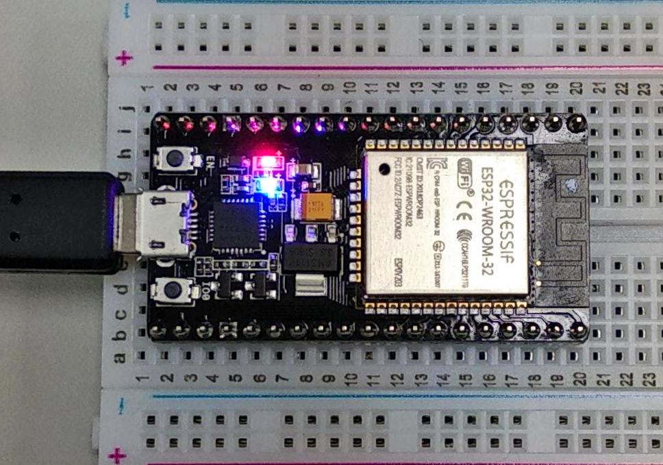

# ESP32-Firebase-Demo

It a firebase CRUD demo for Espressif ESP32 use arduino IDE

## Workspace :
>Chip: Espressif ESP32-WROOM-32  
>Hardware: AI thinker nodemcu-32s  
>IDE: Arduino IDE v1.8.7  
>Arduion Package Version: arduino-esp32 first stable release  
>ArduinoJson: ArduinoJson 5.13.4  

## Installation :
Install CP210x USB to UART Bridge VCP Drivers [link](https://www.silabs.com/products/development-tools/software/usb-to-uart-bridge-vcp-drivers)   
Makesure you already install arduino IDE.  
Put arduino-esp32 package into  arduino main-folder/hardware  
Open arduino-esp32 -> Tool -> get.exe and wait for complete(in windows)  
Open ESP32_Firebase_demo.ino set port and upload speed 115200

##  Setting :
In firebase_function.h set firebase parameter  
In wifi_function.h set wifi parameter  

Follow the step then you can try to debug now.  
##  Demo :
Flash this firmware and set firebase database   
Use GET_MODE, if database have correct data and value is not 0 then LED turn on  

